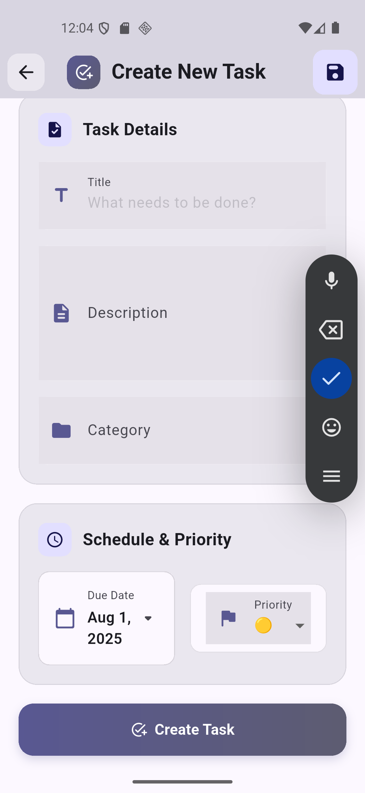

# 📋 My Tasks – Personal Task Manager App

## 🚀 Project Overview

**My Tasks** is a simple and efficient personal task manager built using **Flutter** and **Dart**. The app allows users to add, view, update, and delete tasks using a beautiful and responsive interface. It uses **Provider** for state management and **Sqflite** for local storage, ensuring a fast, offline-first experience. Designed with clean UI, modern color schemes, and full CRUD functionality.

---

## 🌟 Features

- 📝 **Add Task**
  - Create tasks with title and optional description.
  - Stored locally using Sqflite.

- 📋 **Task List**
  - All tasks displayed in a scrollable, clean interface.
  - Completed tasks appear with checkmarks.

- 🗂️ **View Tasks**
  - Display all tasks in a modern, scrollable list
  -  Set due dates and priorities (High, Medium, Low)

- 🧠 **MVVM Structure**
  - Maintainable and scalable codebase
  - Clean, user-friendly dark UI with emoji-enhanced visual cues

- ✏️ **Edit Task**
  - Easily update any task’s title or details.

- ❌ **Delete Task**
  - Swipe or tap to delete tasks.

- ✅ **Task Status**
  - Mark tasks as completed with a single tap.

- 🎨 **Polished UI**
  - Beautiful purple/indigo gradient theme.
  - Modern typography and spacing.

- 💾 **Offline Support**
  - Store tasks locally with Sqflite 

---

## 💻 Tech Stack

| Category         | Technology        |
|------------------|-------------------|
| Language         | Dart              |
| Framework        | Flutter           |
| State Management | Provider          |
| Database         | Sqflite (SQLite)  |
| IDE              | Android Studio    |
| Architecture     | MVVM              |

---

## 📸 Screenshots

| 📋 Task List Screen | ➕ Add Task Screen | ✏️ Edit Task Screen |
|------------------|------------------|------------------|
|  |  |  |

> 💡 Place your screenshots in a `/screenshots` folder in your GitHub repository.

---

## 📝 How to Run

1. Clone the repository.
2. Open in **Android Studio**.
3. Run `flutter pub get` to fetch dependencies.
4. Launch using an emulator or connected device with `flutter run`.

---

## 🔮 Future Enhancements

- ⏰ Add deadline and reminders
- 🔔 Implement notification reminders.
- ☁️Firebase or cloud sync support.
- 🌗 Light/Dark mode toggle feature.
- 📊 Add productivity insights & analytics.
- 🗂️ Task filtering by priority or date.

---

## 🤝 Connect with Me

 [**M-Attaullah**](https://github.com/M-Attaullah)  
 [**Muhammad Attaullah**](https://www.linkedin.com/in/muhammad-attaullah-705764333/)

---

> 🚀 **Note:** This app is developed as part of my **internship task** to strengthen skills in Flutter UI design, state management, and timer-based event handling.
